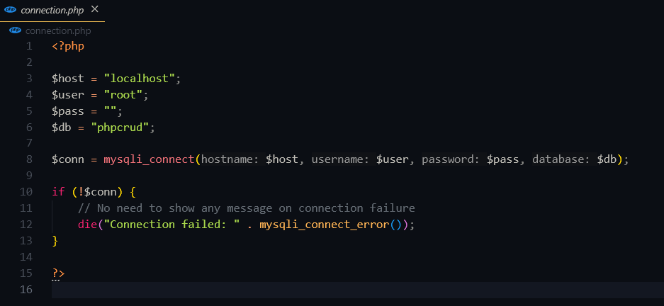
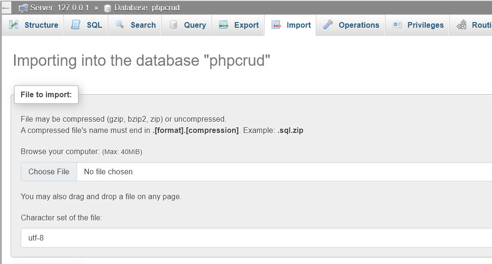
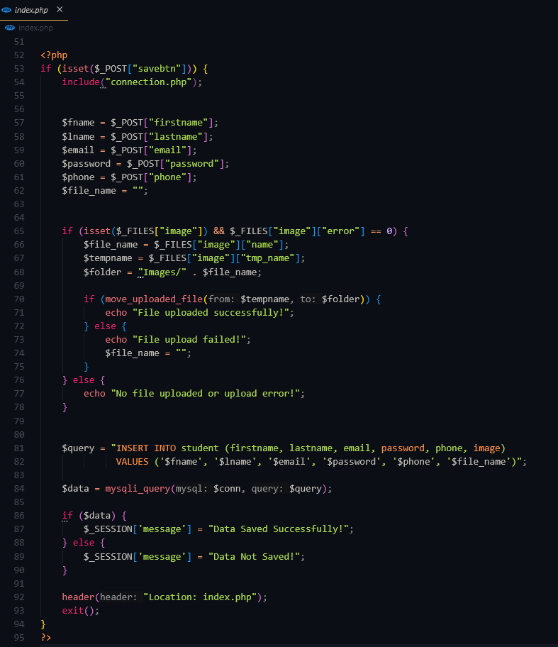
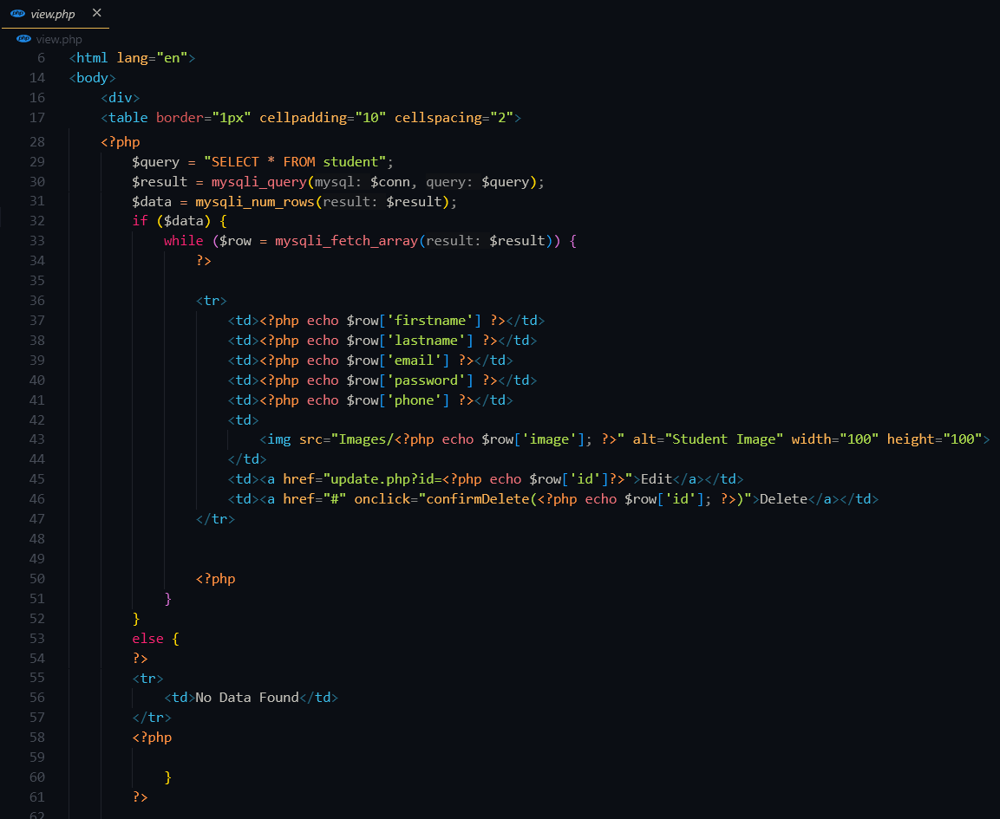
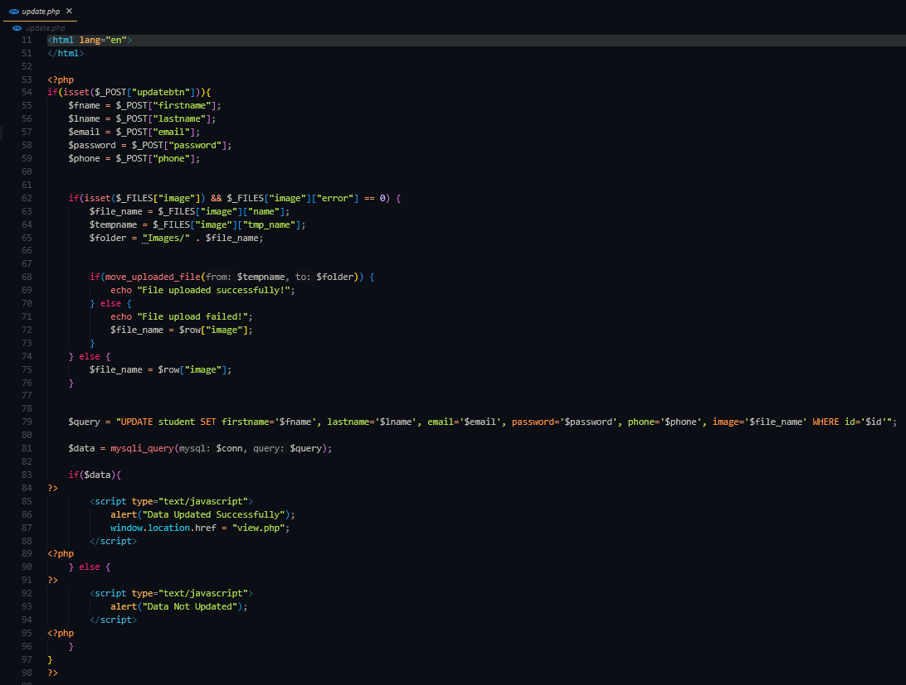
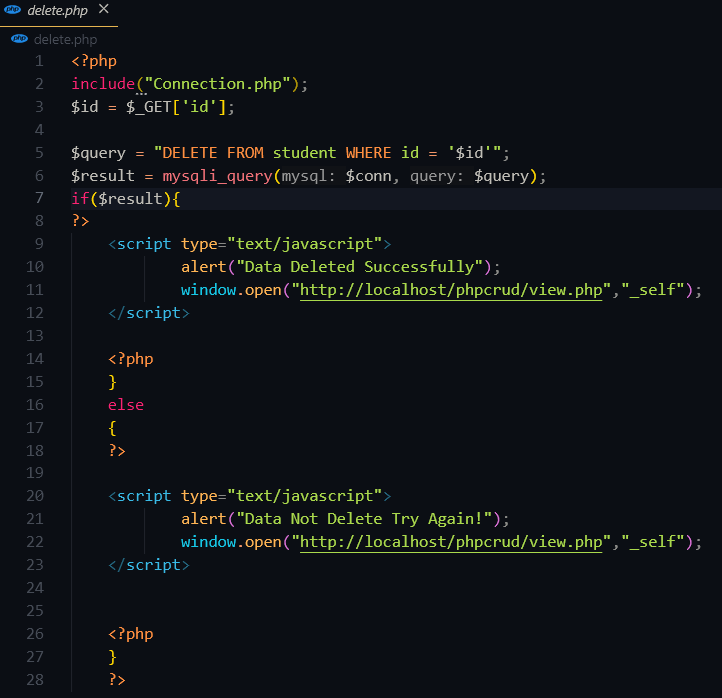

# 📘 PHP CRUD Mini Project

This is a simple CRUD (Create, Read, Update, Delete) project built using **PHP** and **MySQL**, designed to manage student information with image upload functionality.

---

## 🔧 Features

- ➕ Add new student with:
  - First Name
  - Last Name
  - Email
  - Password
  - Phone Number
  - Profile Image
- 📄 View all records in a table format
- ✏️ Update existing records
- ❌ Delete records with confirmation
- 📁 Upload and display images
- ✅ Success message with PHP session
- 💡 Clean & basic styled UI using CSS

---

## 🛠️ Tech Stack

- Frontend: HTML5, CSS3
- Backend: PHP
- Database: MySQL (phpMyAdmin)
- Server: XAMPP (Apache + MySQL)

---

## 📂 Project Structure

phpcrud/ ├── db/ │ └── phpcrud.sql # Database import file ├── Images/ # Folder for uploaded images ├── index.php # Insert new student ├── view.php # View all students ├── update.php # Update student data ├── delete.php # Delete student record ├── connection.php # Database connection ├── mystyle.css # External CSS styling └── README.md # Project documentation


---

## 🔌 Installation Steps

### 1. Clone the repository

```bash
git clone https://github.com/your-username/phpcrud.git

2. Import Database
Open http://localhost/phpmyadmin

Create a new database named: phpcrud

Go to the Import tab and choose the file:
db/phpcrud.sql

Click Go to import the tables

3. Run the project
Open XAMPP → Start Apache and MySQL

Open browser and go to:
http://localhost/phpcrud/index.php

🙋‍♂️ Created By
Maulik Vaghela
GitHub: @MaulikVaghela2210


---

### ⚙️ Next Steps for You:
1. Create a folder in your project: `db`
2. Move your `phpcrud.sql` file inside it
3. Add the above `README.md` file at root
4. Now push everything to GitHub:

```bash
git add .
git commit -m "Added full CRUD project with README and database"
git push origin main


## Screenshots

The following screenshots showcase different steps in the PHP CRUD mini project:

1. [Database Connection](screenshots/db-connection.png)
   - Screenshot of the database connection settings.
   

2. [Import Database](screenshots/import-db.png)
   - Screenshot showing how to import the database in phpMyAdmin.
   

3. [Insert Data Form](screenshots/insert-form.png)
   - Screenshot of the form used to insert student data into the system.
   

4. [View Data](screenshots/view-data.png)
   - Screenshot of the page where you can view all students' data.
   

5. [Update Data Form](screenshots/update-form.png)
   - Screenshot of the form used to update student data.
   

6. [Delete Data](screenshots/delete-data.png)
   - Screenshot of the delete confirmation for removing student data.
   
